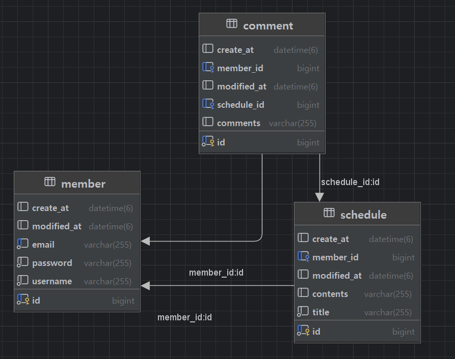

# 일정 관리 앱 Develop

Spring, Spring Boot, MySQL, JAVA, JPA, Bcrypt

## 기능

### Lv 0. API 명세서 및 ERD 작성

1. **API 명세서**

- 회원가입
  - POST
  - /members/signup
> request
> ```json
> {
>     "username": "test",
>     "password": "qwer1234",
>     "email": "test@test.com"
> }
> ```

> response
> ```json
> {
>     "id": 1,
>     "username": "test",
>     "email": "test@test.com"
> }
> ```

2. **ERD**



3. **SQL**